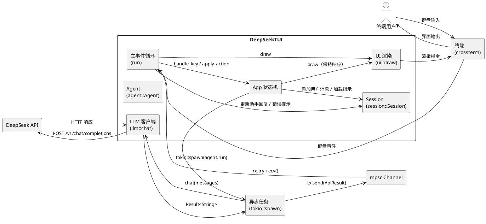
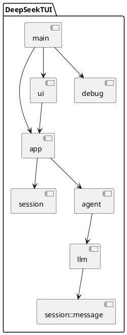

# **1. 实现模型**

## **1.1 上下文视图**



**变更要点**：引入 `tokio::spawn` 异步任务和 `mpsc` channel，将 API 调用从主事件循环中解耦；主循环通过 `try_recv` 非阻塞轮询 channel 消息，保证 100ms 轮询间隔内完成事件处理和渲染。

## **1.2 服务/组件总体架构**

### **1.2.1 模块依赖关系**



### **1.2.2 模块职责与变更说明**

| 模块 | 当前职责 | 变更内容 |
|------|----------|----------|
| `main` | 初始化终端、创建 App、运行事件循环 | 在 `main()` 中调用 `dotenv()`（仅一次）；在 `run()` 中增加 channel 轮询逻辑 |
| `app` | 维护 App 状态、处理按键、执行 Action | 新增 `is_loading` 状态字段；新增 `tx`/`rx` channel 字段；`apply_action` 中 SendMessage 改为 spawn 异步任务而非直接 await；新增 `poll_channel` 方法处理异步结果 |
| `agent` | 封装 LLM 调用 | 签名不变，内部由 `llm::chat` 驱动 |
| `llm` | 构建并发送 HTTP 请求 | 移除 `dotenv()` 调用；修正模型名称为 `deepseek-chat`；错误处理返回结构化错误信息 |
| `session` | 管理会话消息列表 | 不变 |
| `session::message` | 消息数据结构 | 不变 |
| `ui` | 渲染 TUI 界面 | 渲染逻辑中支持"思考中..."加载指示 |
| `debug` | 初始化日志 | 不变 |

### **1.2.3 架构变更：异步通信管道**

```
┌─────────────────────────────────────────────────────────────────┐
│ 主事件循环 (run)                                                 │
│                                                                 │
│  ┌──────────┐    ┌──────────────┐    ┌──────────────────────┐  │
│  │ poll 事件 │───▶│ handle_key   │───▶│ apply_action         │  │
│  └──────────┘    └──────────────┘    │  ├─ Quit             │  │
│                                       │  ├─ SwitchFocus      │  │
│                                       │  └─ SendMessage      │  │
│  ┌──────────┐                         │     ├─ 添加用户消息    │  │
│  │ draw UI  │◀───┐                    │     ├─ 设置 is_loading │  │
│  └──────────┘    │                    │     ├─ tokio::spawn   │  │
│                  │                    │     └─ 清空输入框      │  │
│  ┌──────────────┐│                    └──────────────────────┘  │
│  │poll_channel  ││                                              │
│  │  try_recv()  ├┘                                              │
│  └──────┬───────┘                                               │
│         │ rx                                                    │
└─────────┼──────────────────────────────────────────────────────┘
          │
          │  mpsc::channel<ApiResult>
          │
┌─────────┼──────────────────────────────────────────────────────┐
│  异步任务│                                                      │
│  ┌──────▼─────────────────────────────────────────────────────┐ │
│  │  agent.run(messages)                                      │ │
│  │    └─ llm::chat(messages)                                 │ │
│  │         └─ reqwest POST → DeepSeek API                    │ │
│  │  tx.send(ApiResult::Ok/Err)                               │ │
│  └───────────────────────────────────────────────────────────┘ │
└────────────────────────────────────────────────────────────────┘
```

## **1.3 实现设计文档**

### **1.3.1 main 模块变更**

**文件**：`src/main.rs`

**变更内容**：

1. **dotenv 单次初始化**：在 `main()` 函数开头、创建终端和 App 实例之前调用 `dotenvy::dotenv()`，且仅此一处
2. **channel 创建**：在 `run()` 函数中创建 `tokio::sync::mpsc::channel<ApiResult>`，将 `tx` 传入 App，`rx` 保留在 `run()` 中
3. **channel 轮询**：在每个事件循环迭代中，调用 `rx.try_recv()` 检查是否有 API 响应结果，若有则调用 `app.handle_api_result(result)` 处理

**伪代码**：

```
fn main():
    dotenvy::dotenv().ok()          // 仅此一处
    init_log()
    terminal = ratatui::init()
    app = App::new()
    result = run(terminal, app)
    ratatui::restore()
    result

fn run(terminal, app):
    (tx, rx) = mpsc::channel::<ApiResult>(16)
    app.set_sender(tx)

    while !app.should_quit:
        // 轮询 channel 结果（非阻塞）
        while let Ok(result) = rx.try_recv():
            app.handle_api_result(result)

        terminal.draw(frame => ui::draw(frame, app))

        if event::poll(100ms):
            if Event::Key(key):
                if let Some(action) = app.handle_key(key):
                    app.apply_action(action)    // 不再 await
```

### **1.3.2 app 模块变更**

**文件**：`src/app/mod.rs`

**变更内容**：

1. **新增 `ApiResult` 枚举**：定义异步任务通过 channel 传回的结果类型

```rust
pub enum ApiResult {
    Ok(String),          // API 成功响应，包含助手回复文本
    Err(String),         // API 调用失败，包含可读错误描述
}
```

2. **App 结构体新增字段**：

```rust
pub struct App {
    pub focus: Focus,
    pub textarea: TextArea<'static>,
    pub should_quit: bool,
    pub session: Session,
    pub agent: agent::Agent,
    pub is_loading: bool,                              // 新增：加载状态标志
    pub tx: Option<mpsc::UnboundedSender<ApiResult>>,  // 新增：channel 发送端
}
```

3. **`apply_action` 变更**：`SendMessage` 分支不再直接 `await`，改为 `tokio::spawn` 发起异步任务

```rust
Action::SendMessage => {
    let text = self.textarea.lines().join("\n");
    if text.trim().is_empty() {
        return;
    }

    self.session.add_user_message(text);
    self.is_loading = true;
    self.textarea = TextArea::new(vec![]);

    if let Some(tx) = self.tx.clone() {
        let messages = self.session.messages.clone();
        tokio::spawn(async move {
            let result = match agent::Agent.run(&messages).await {
                Ok(reply) => ApiResult::Ok(reply),
                Err(e) => ApiResult::Err(format_error(&e)),
            };
            let _ = tx.send(result);
        });
    }
}
```

4. **新增 `handle_api_result` 方法**：处理 channel 传回的 API 结果

```rust
pub fn handle_api_result(&mut self, result: ApiResult) {
    self.is_loading = false;
    match result {
        ApiResult::Ok(reply) => {
            self.session.add_assistant_message(reply);
        }
        ApiResult::Err(err_msg) => {
            self.session.add_assistant_message(format!("[错误] {}", err_msg));
        }
    }
}
```

5. **新增 `set_sender` 方法**：设置 channel 发送端

6. **`apply_action` 签名变更**：由 `async fn` 变为同步 `fn`（SendMessage 不再 await）

### **1.3.3 llm 模块变更**

**文件**：`src/llm/mod.rs`

**变更内容**：

1. **移除 `dotenv()` 调用**：删除 `dotenv().ok()` 行，环境变量初始化已移至 `main()`
2. **修正模型名称**：将 `"deepseek-v4-flash"` 改为 `"deepseek-chat"`
3. **错误信息格式化增强**：对 `env::var` 错误返回更友好的提示

```rust
pub async fn chat(messages: &[Message]) -> Result<String> {
    // 不再调用 dotenv()

    let api_key = env::var("DEEPSEEK_KEY")
        .map_err(|_| anyhow!("API 密钥未配置，请检查 DEEPSEEK_KEY 环境变量"))?;

    let client = Client::builder()
        .timeout(Duration::from_secs(60))
        .build()?;

    let res = client
        .post("https://api.deepseek.com/v1/chat/completions")
        .header("Authorization", format!("Bearer {}", api_key))
        .json(&json!({
            "model": "deepseek-chat",    // 修正模型名称
            "messages": messages
        }))
        .send()
        .await?;

    let status = res.status();
    let text = res.text().await?;

    if !status.is_success() {
        return Err(anyhow!("HTTP {}: {}", status, text));
    }

    let json: serde_json::Value = serde_json::from_str(&text)?;
    let content = json["choices"][0]["message"]["content"]
        .as_str()
        .ok_or_else(|| anyhow!("响应格式错误: 缺少 choices[0].message.content"))?;

    Ok(content.to_string())
}
```

### **1.3.4 agent 模块变更**

**文件**：`src/agent/mod.rs`

**变更内容**：无结构性变更。`Agent::run` 签名和逻辑保持不变，内部由 `llm::chat` 驱动。错误处理已在 `llm::chat` 层完成。

### **1.3.5 ui 模块变更**

**文件**：`src/ui/mod.rs`

**变更内容**：

1. **渲染加载指示**：当 `app.is_loading` 为 `true` 时，在会话列表末尾显示"思考中..."提示项

```rust
fn render_session_list(f, app, area):
    items = app.session.messages.iter().map(|m| {
        prefix = match m.role { "user" => "👤 ", "assistant" => "🤖 ", _ => "" }
        ListItem::new(format!("{}{}", prefix, m.content))
    }).collect();

    // 加载指示
    if app.is_loading:
        items.push(ListItem::new("🤖 思考中...".italic()));

    // 渲染列表...
```

2. **错误消息样式**：角色为 `assistant` 且内容以 `[错误]` 开头的消息，使用红色前景色渲染

### **1.3.6 session 模块变更**

**文件**：`src/session/mod.rs`、`src/session/message.rs`

**变更内容**：无结构性变更。`Message` 结构体和 `Session` 的方法保持不变。为支持异步任务中的 `messages.clone()`，`Message` 已派生 `Clone`（当前已有），`Session.messages` 类型为 `Vec<Message>` 可直接 clone。

---

# **2. 接口设计**

## **2.1 总体设计**

本组件内部接口变更集中在三个层面：

1. **App ↔ 异步任务**：通过 `mpsc::UnboundedSender<ApiResult>` / `try_recv()` 进行异步通信
2. **App ↔ Agent**：`Agent::run` 签名不变，但调用方式由同步 await 变为 `tokio::spawn` 内调用
3. **App ↔ UI**：UI 渲染函数新增对 `is_loading` 状态的读取，以展示加载指示

## **2.2 接口清单**

### **2.2.1 ApiResult 枚举**

```
enum ApiResult:
  - Ok(String)     // API 成功返回的助手回复文本
  - Err(String)    // API 失败的可读错误描述
```

**设计约束**：
- `Err` 变体的字符串必须是面向用户的可读错误信息，不得包含 Rust 错误堆栈
- 错误信息格式：`[错误类型]: [简要描述]`，如 `HTTP 400: model not found`

### **2.2.2 App 公开接口变更**

| 方法 | 签名 | 变更说明 |
|------|------|----------|
| `apply_action` | `fn apply_action(&mut self, action: Action)` | 由 `async fn` 变为同步 `fn`；SendMessage 不再 await |
| `set_sender` | `fn set_sender(&mut self, tx: UnboundedSender<ApiResult>)` | 新增：设置 channel 发送端 |
| `handle_api_result` | `fn handle_api_result(&mut self, result: ApiResult)` | 新增：处理异步任务返回的 API 结果 |

### **2.2.3 Agent 接口（不变）**

```rust
impl Agent {
    pub async fn run(&self, messages: &[Message]) -> Result<String>;
}
```

### **2.2.4 LLM 接口（不变）**

```rust
pub async fn chat(messages: &[Message]) -> Result<String>;
```

**行为变更**：移除内部 `dotenv()` 调用，修正模型名称，增强错误消息可读性。

### **2.2.5 UI 渲染接口（不变）**

```rust
pub fn draw(f: &mut Frame, app: &mut App);
```

**行为变更**：内部渲染逻辑增加对 `app.is_loading` 和错误消息样式的处理。

### **2.2.6 format_error 辅助函数**

```
fn format_error(err: &Box<dyn Error + Send + Sync>) -> String
```

将 anyhow 错误转换为面向用户的可读字符串：
- `reqwest` 错误：提取超时 / 连接失败 / HTTP 状态码信息
- `env` 错误：返回"API 密钥未配置，请检查 DEEPSEEK_KEY 环境变量"
- JSON 解析错误：返回"响应格式错误"
- 其他错误：返回原始错误描述

---

# **4. 数据模型**

## **4.1 设计目标**

1. **异步通信消息类型**：定义 `ApiResult` 枚举，封装 API 调用的成功/失败结果，供 channel 传递
2. **加载状态**：在 `App` 中新增 `is_loading: bool` 字段，驱动 UI 加载指示渲染
3. **错误消息规范**：统一错误提示格式，以 `[错误]` 前缀标识，以 `assistant` 角色存入会话
4. **消息克隆安全**：确保 `Message` 可安全克隆以传入 `tokio::spawn` 闭包

## **4.2 模型实现**

### **4.2.1 ApiResult（新增）**

```rust
pub enum ApiResult {
    /// DeepSeek API 成功响应，包含助手回复文本
    Ok(String),
    /// DeepSeek API 调用失败，包含面向用户的可读错误描述
    Err(String),
}
```

**不变量**：
- `ApiResult::Ok` 中的字符串不得为空
- `ApiResult::Err` 中的字符串必须以错误类型标识开头（如 `HTTP 400`、`API 密钥未配置`）

### **4.2.2 App 结构体变更**

```rust
pub struct App {
    pub focus: Focus,
    pub textarea: TextArea<'static>,
    pub should_quit: bool,
    pub session: Session,
    pub agent: agent::Agent,
    /// 当前是否有 API 请求正在进行中
    pub is_loading: bool,
    /// 异步任务结果 channel 的发送端，用于在 spawn 的任务中传回 API 结果
    pub tx: Option<mpsc::UnboundedSender<ApiResult>>,
}
```

**字段语义**：
- `is_loading = true`：表示已有 API 请求发出但尚未收到响应，UI 应显示"思考中..."
- `is_loading = false`：无进行中的请求，UI 正常显示会话内容
- `tx`：在 `App::new()` 时为 `None`，由 `run()` 中通过 `set_sender` 设置

### **4.2.3 Message（不变）**

```rust
#[derive(Serialize, Deserialize, Debug, Clone)]
pub struct Message {
    pub role: String,
    pub content: String,
}
```

**已有约束**：`Clone` 派生确保可在 `tokio::spawn` 闭包中通过 `messages.clone()` 传入。

### **4.2.4 Session（不变）**

```rust
#[derive(Debug, Serialize, Deserialize)]
pub struct Session {
    pub id: String,
    pub messages: Vec<Message>,
    pub created_at: u64,
    pub updated_at: u64,
}
```

### **4.2.5 错误消息格式规范**

| 错误场景 | 错误消息格式 | 示例 |
|----------|-------------|------|
| API 密钥未配置 | `API 密钥未配置，请检查 DEEPSEEK_KEY 环境变量` | — |
| HTTP 错误响应 | `HTTP {status}: {body摘要}` | `HTTP 400: model not found` |
| 请求超时 | `请求超时（60秒），请检查网络连接后重试` | — |
| 网络连接失败 | `网络连接失败: {错误描述}` | `网络连接失败: connection refused` |
| JSON 解析失败 | `响应格式错误: {字段路径}` | `响应格式错误: 缺少 choices[0].message.content` |
| 其他错误 | `{原始错误描述}` | — |

**UI 展示**：错误消息以 `assistant` 角色添加到会话列表，content 为 `[错误] {格式化错误消息}`，渲染时以红色前景色显示。
