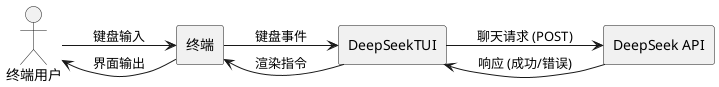
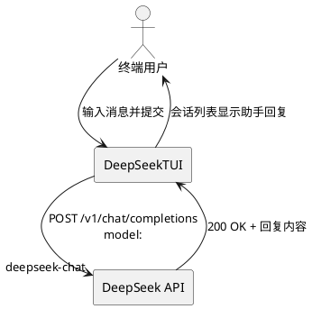
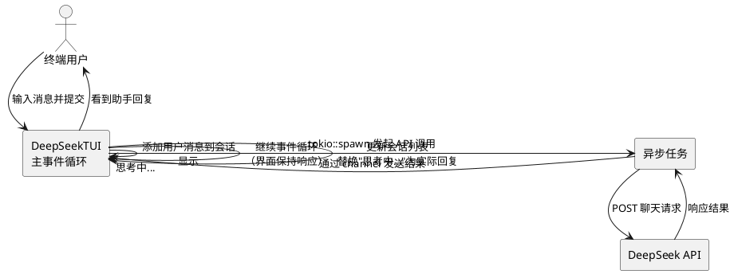
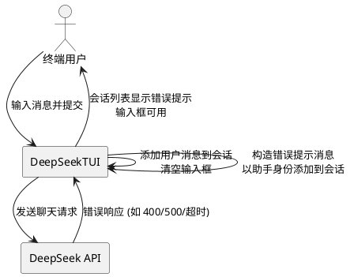

# **1. 组件定位**

## **1.1 核心职责**

本组件负责修复 DeepSeekTUI 应用的四个关键缺陷，确保用户输入消息后能正常调用 DeepSeek API 并在会话列表中渲染回复。

## **1.2 核心输入**

1. 用户在输入框输入文本后按 Ctrl+Enter 提交的聊天消息
2. DeepSeek API 返回的 HTTP 响应（成功或错误）
3. `.env` 文件中的 `DEEPSEEK_KEY` 环境变量

## **1.3 核心输出**

1. 会话列表区域渲染的用户消息和 DeepSeek 助手回复
2. API 调用失败时的错误提示信息（在会话列表中以助手消息形式展示）
3. 请求等待期间的 UI 加载状态指示

## **1.4 职责边界**

1. 不负责 DeepSeek API 本身的可用性和响应质量
2. 不负责实现流式输出（streaming）功能
3. 不负责多会话管理功能的实现
4. 不负责 DeepSeek API 密钥的获取和管理，仅从环境变量读取

# **2. 领域术语**

**DeepSeek API**
: DeepSeek 官方提供的大语言模型 HTTP 接口服务，端点为 `https://api.deepseek.com/v1/chat/completions`。

**模型名称**
: API 请求中 `model` 字段的值，用于指定调用哪个 DeepSeek 模型。合法值为 `deepseek-chat`（V3）和 `deepseek-reasoner`（R1）。
: 备注：当前代码中错误使用 `deepseek-v4-flash`，该模型不存在。

**主事件循环**
: TUI 应用的核心循环，负责轮询键盘事件、更新应用状态、重绘终端界面。

**会话列表**
: TUI 界面上方区域，以列表形式展示当前会话中的所有用户消息和助手回复。

**异步任务**
: 在 tokio 运行时中启动的并发任务，不阻塞主事件循环，用于执行耗时的 API 调用。

**channel**
: tokio 的多生产者单消费者通道（mpsc），用于异步任务与主事件循环之间的消息传递。

# **3. 角色与边界**

## **3.1 核心角色**

- 终端用户：在 TUI 输入框中输入消息、提交聊天请求、查看会话列表中的回复

## **3.2 外部系统**

- DeepSeek API：接收聊天请求并返回模型生成的回复文本，或返回 HTTP 错误响应
- 终端（crossterm）：提供键盘事件输入和界面渲染输出能力

## **3.3 交互上下文**



# **4. DFX约束**

## **4.1 性能**

1. API 调用期间主事件循环的轮询间隔不得超过 100ms，确保终端界面保持响应
2. 从异步任务完成到 UI 更新渲染的延迟不得超过一个事件循环周期（100ms）

## **4.2 可靠性**

1. API 调用失败时应用不得 panic 崩溃，必须继续运行
2. 应用必须将 API 错误信息展示给用户，不得静默丢弃错误
3. `DEEPSEEK_KEY` 环境变量缺失时，应用应在首次提交消息时给出明确的错误提示

## **4.3 安全性**

1. `DEEPSEEK_KEY` 不得在日志或 UI 中明文展示
2. API 密钥仅通过环境变量获取，不得硬编码

## **4.4 可维护性**

1. `dotenv` 初始化必须在应用启动时执行一次，禁止在每次 API 调用时重复执行

## **4.5 兼容性**

1. 修复后的模型名称必须是 DeepSeek API 当前支持的合法模型标识符

# **5. 核心能力**

## **5.1 API 模型名称修正**

### **5.1.1 业务规则**

1. **模型名称合法性**：发送给 DeepSeek API 的请求中 `model` 字段必须使用官方支持的模型名称

   a. 验收条件：[发送聊天请求] → [请求 JSON 中 model 字段值为 `deepseek-chat`]

2. **禁止使用无效模型名称**：禁止在 API 请求中使用 `deepseek-v4-flash` 或任何 DeepSeek API 不承认的模型名称

   a. 验收条件：[API 请求体包含 `deepseek-v4-flash`] → [请求必然收到 400 Bad Request 响应]

### **5.1.2 交互流程**



### **5.1.3 异常场景**

1. **模型名称无效**

   a. 触发条件：API 请求中 model 字段值不被 DeepSeek API 识别

   b. 系统行为：API 返回 400 错误，应用捕获错误并在会话列表中显示错误提示

   c. 用户感知：会话列表中出现带错误标识的助手消息，内容包含 HTTP 状态码和错误描述

2. **API 密钥缺失**

   a. 触发条件：环境变量 `DEEPSEEK_KEY` 未设置

   b. 系统行为：应用捕获环境变量读取错误，在会话列表中显示错误提示

   c. 用户感知：会话列表中出现错误提示消息，提示用户检查 API 密钥配置

## **5.2 API 调用异步化**

### **5.2.1 业务规则**

1. **非阻塞调用**：API 调用必须在独立的异步任务中执行，不得在主事件循环中直接 await

   a. 验收条件：[用户提交消息后 API 正在响应中] → [终端界面保持响应，用户可以继续输入和切换焦点]

2. **结果传递**：异步任务完成后必须通过 channel 将结果传递回主事件循环

   a. 验收条件：[异步任务获得 API 响应] → [主事件循环在下一个轮询周期接收到响应结果]

3. **加载状态指示**：API 请求期间会话列表应显示加载指示

   a. 验收条件：[用户提交消息后 API 尚未返回] → [会话列表中出现加载中提示（如"思考中..."）]

4. **禁止主循环阻塞**：主事件循环中禁止对可能耗时超过 100ms 的异步操作直接 await

   a. 验收条件：[API 响应耗时 10 秒] → [主事件循环在此期间仍以 100ms 间隔正常轮询和渲染]

### **5.2.2 交互流程**



### **5.2.3 异常场景**

1. **API 响应超时**

   a. 触发条件：API 调用超过客户端设定的超时时间（60秒）仍未返回

   b. 系统行为：reqwest 客户端返回超时错误，异步任务通过 channel 发送错误信息

   c. 用户感知：会话列表中"思考中..."被替换为超时错误提示

2. **网络连接失败**

   a. 触发条件：无法建立与 `api.deepseek.com` 的网络连接

   b. 系统行为：异步任务捕获连接错误并通过 channel 发送错误信息

   c. 用户感知：会话列表中出现网络错误提示

## **5.3 错误处理改进**

### **5.3.1 业务规则**

1. **禁止 unwrap 崩溃**：API 调用结果禁止使用 `unwrap()` 直接解包，必须进行错误处理

   a. 验收条件：[API 调用返回 Err] → [应用不 panic，继续运行并在 UI 展示错误信息]

2. **错误信息可读**：错误提示必须包含对用户有意义的信息（如错误类型、HTTP 状态码、简短描述），而非原始的 Rust 错误堆栈

   a. 验收条件：[DeepSeek API 返回 400 Bad Request] → [会话列表显示包含"400"和错误原因的提示消息]

3. **错误消息以助手身份展示**：API 错误信息应以助手消息形式添加到会话中，保持会话连续性

   a. 验收条件：[API 调用失败] → [会话列表中出现一条角色为 assistant 的错误提示消息]

4. **输入框在错误后仍可用**：即使 API 调用失败，输入框必须清空并保持可用状态，允许用户重新输入

   a. 验收条件：[API 调用失败后] → [输入框已清空，用户可以输入新消息并提交]

### **5.3.2 交互流程**



### **5.3.3 异常场景**

1. **响应 JSON 格式异常**

   a. 触发条件：API 返回 200 但响应体 JSON 结构不符合预期（如缺少 `choices` 字段）

   b. 系统行为：JSON 解析失败，应用捕获错误并在会话列表中显示"响应格式错误"提示

   c. 用户感知：会话列表中出现格式错误提示消息

2. **环境变量读取失败**

   a. 触发条件：`DEEPSEEK_KEY` 环境变量未配置

   b. 系统行为：应用捕获错误，在会话列表中显示密钥缺失提示

   c. 用户感知：会话列表中出现"API 密钥未配置，请检查 DEEPSEEK_KEY 环境变量"提示

## **5.4 环境变量初始化优化**

### **5.4.1 业务规则**

1. **单次初始化**：`dotenv()` 必须仅在应用启动时调用一次

   a. 验收条件：[应用启动] → [dotenv() 执行一次]；[后续每次 API 调用] → [不再执行 dotenv()]

2. **初始化时序**：`dotenv()` 必须在任何环境变量读取操作之前执行

   a. 验收条件：[应用启动流程中] → [dotenv() 在创建 App 实例之前完成]

3. **禁止循环调用**：严禁在 `chat` 函数或任何可能被反复调用的代码路径中执行 `dotenv()`

   a. 验收条件：[用户连续提交 10 条消息] → [dotenv() 总调用次数为 1]

### **5.4.2 交互流程**

```plantuml
@startuml
rectangle "DeepSeekTUI" as App

App -> App : main() 启动
App -> App : dotenv() 加载 .env（仅此一次）
App -> App : 创建 App 实例
App -> App : 进入主事件循环
... 用户交互期间 ...
App -> App : 提交消息 → 读取环境变量（不再调用 dotenv）
@enduml
```

### **5.4.3 异常场景**

1. **.env 文件不存在**

   a. 触发条件：项目目录下没有 `.env` 文件

   b. 系统行为：`dotenv()` 调用静默忽略（当前行为），依赖系统环境变量

   c. 用户感知：若 `DEEPSEEK_KEY` 也未在系统环境变量中设置，则在首次提交消息时看到密钥缺失提示

# **6. 数据约束**

## **6.1 API 请求体**

1. **model**：必须为 DeepSeek API 支持的合法模型名称，当前合法值为 `deepseek-chat` 或 `deepseek-reasoner`
2. **messages**：消息数组，每条消息包含 `role`（`user`/`assistant`/`system`）和 `content`（非空字符串）

## **6.2 会话消息**

1. **role**：取值范围为 `user`、`assistant`、`system`，其中错误提示消息使用 `assistant` 角色
2. **content**：非空字符串；错误提示消息的 content 以错误标识前缀开头（如 `[错误]`）

## **6.3 异步通信消息**

1. **消息类型**：分为成功响应（包含助手回复文本）和失败响应（包含错误描述文本）两种
2. **消息顺序**：channel 中的消息顺序必须与 API 调用发起顺序一致
